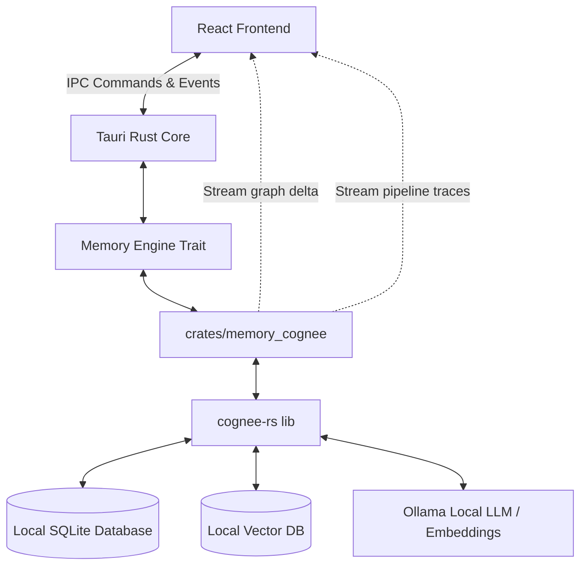

# 🐶 ChowChow

> **The Sovereign Supply Chain Risk Engine**
> 
> *A desktop-native application designed to map, analyze, and protect complex supply chains in a completely local, private environment. Built for the **Cognee** hackathon.*

---

## 💡 Overview

Modern supply chains are highly fragile, opaque, and constantly shifting. A delay at a single port or a failure at a tier-2 supplier can cascade into a catastrophic disruption. **ChowChow** solves this by constructing a local, semantic Knowledge Graph of your supply chain network, automatically identifying single points of failure (SPOFs), and mapping risk propagation.

By leveraging **cognee-rs** (the Rust implementation of Cognee) and local LLMs (via Ollama), ChowChow runs entirely on the operator's machine. None of your sensitive supply chain data, vendor emails, or shipment logs ever leave your local environment.

---

## 🧠 Cognee Integration

ChowChow uses **cognee-rs** as its cognitive memory and reasoning backend. The integration includes:

| Cognee Primitive | How ChowChow Uses It |
| :--- | :--- |
| **`api::remember()`** | Extracts entities (Suppliers, Materials, Ports, Factories, Customers) and relationships from unstructured files (emails, manifests, ERP reports) to populate the Knowledge Graph. |
| **`api::recall()`** | Performs semantic search and Graph RAG traversal to trace how materials flow through the network and answer operator questions with precise reasoning paths. |
| **`api::improve()`** | Drives closed-loop graph refinement and correction when operators reconcile conflicting supply chain intelligence. |

### 🛠 Custom Core Integrations
* **Live Graph Interceptor (`LiveGraphDb`):** A custom wrapper around Cognee's `GraphDBTrait` that captures node and edge additions in real time, streaming graph growth to the interactive UI.
* **Traced LLM & Embedding (`TracedLlm` / `TracedEmbedding`):** Intercepts internal Cognee LLM prompts and embedding operations, piping them into a live **Cognition Trace** panel so operators can visualize the reasoning process step-by-step.
* **Ontology Enforcement:** Configures and enforces a custom RDF/OWL ontology (`supplychain.org/ontology`) during extraction to ensure the Knowledge Graph adheres to strict domain boundaries (e.g. `Supplier -- supplies --> Material -- ships_via --> Port`).

---

## ✨ Key Features

### 1. Ingestion Command Center
Drag and drop unstructured text files, ERP CSVs, and email chains. ChowChow automatically chunks, extracts, embeds, and indexes them into the knowledge graph.

### 2. Interactive Graph Explorer
Visualize the entire supply chain network. 
* **Criticality Scoring:** Automatically ranks nodes by dependency weight.
* **Single Points of Failure (SPOFs):** Graph analytics identify articulation points (e.g. a chokepoint harbor or a single-source distributor) and highlights them with an amber-dashed halo.
* **Spotlight Mode:** Hover over any node to highlight its immediate upstream suppliers and downstream customers.

### 3. Blast Radius Simulator
Simulate disruption cascades:
* Select any node (e.g. *Port of Long Beach* or a supplier facing insolvency).
* Click **Trace Blast Radius** to see the failure cascade hop-by-hop.
* View exposure bars and decay-mapped severity alerts showing exactly which end customers and factories will feel the impact.

### 4. Drift Sentinel (Continuous Verification)
When new documents (like route update emails) are ingested, the **Drift Sentinel** background worker cross-examines the new claims against the existing knowledge graph. If contradictions are found, it generates a **Drift Alert** in the command center.

### 5. Closed-Loop Correction
Resolve drift alerts in one click. ChowChow uses LLM intent extraction to translate natural language updates into structured graph operations—deprecating invalid relationships and creating new nodes/edges to reflect reality.

---

## 📐 Architecture



---

## 🚀 Quick Start

### Prerequisites
1. **Rust:** Install via [rustup](https://rustup.rs/)
2. **Node.js / Bun:** Install Node.js or [Bun](https://bun.sh/)
3. **Ollama:** Install [Ollama](https://ollama.com/) and run the model:
   ```bash
   ollama run gemma4
   ```

### Installation
1. Clone the repository and install dependencies:
   ```bash
   bun install   # or: npm install
   ```
2. Set up your environment files (optional, for Google integration):
   ```bash
   cp .env.example .env
   ```
3. Start the application in development mode:
   ```bash
   bun run tauri dev   # or: npm run tauri dev
   ```

---

## 🧪 Testing

The codebase includes a three-tier testing strategy:

```bash
# Tier 1: Rust unit & service tests (no LLM required)
cd src-tauri && cargo test

# Tier 2: Frontend unit tests (graph analytics, SPOF detection)
bun test   # or: npm test

# Tier 3: E2E smoke tests against real Cognee + Ollama
cd src-tauri
cargo run -p memory_cognee --example smoke             # Ingest & Query
cargo run -p memory_cognee --example correction_smoke  # Feedback loop
cargo run -p memory_cognee --example sentinel_smoke    # Drift detection
```

For more testing details, see [TESTING.md](file:///Users/adityarajpanjiyara/projects/AwsmThreesome/TESTING.md).

---

## 📽 Demo Walkthrough (The Golden Path)

To experience the full capability of ChowChow and Cognee:

1. **Open Cognition Trace:** Click the trace icon in the header to view live pipeline logs.
2. **Ingest Seed Data:** Go to *Ingestion* and upload `demo_data/vegas_intel_report.txt` and `chow_shipments_erp.csv`. Watch the trace capture LLM entity extraction and vector writes.
3. **Analyze SPOFs:** Open *Graph Explorer*. Notice the amber-dashed halo around **Port of Long Beach** (detected SPOF).
4. **Simulate a Crisis:** Click on *Port of Long Beach* and select **Trace blast radius**. See the impact cascade across the network.
5. **Query the Graph:** Go to *Query* and ask: *"Who supplies Lucky Lotus Powder and how does it reach the Wolfpack?"* View the answer and its reasoning path.
6. **Detect Drift:** Ingest `demo_data/chow_route_update_email.txt` (states shipment routes have changed). Check the Command Center for a **Drift Sentinel Alert**.
7. **Apply Correction:** Click **Review & apply correction**. Confirm the change. Cognee will deprecate the old path and establish the new route.
8. **Verify Learning:** Re-run your query from Step 5. Notice that the answer has successfully updated to reflect the new route!
